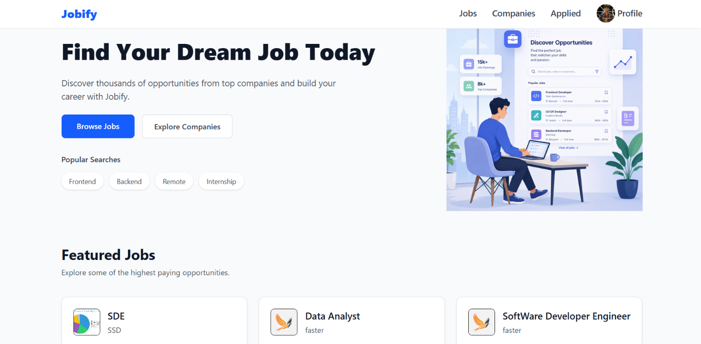
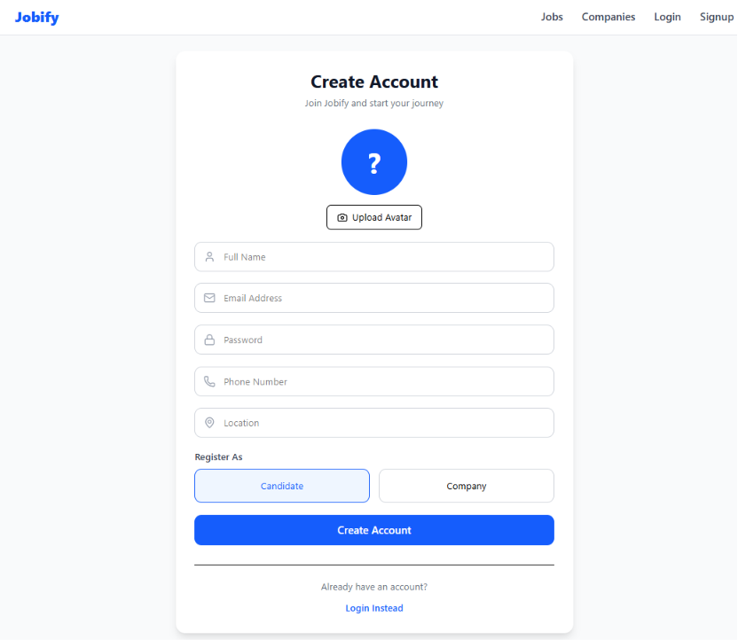
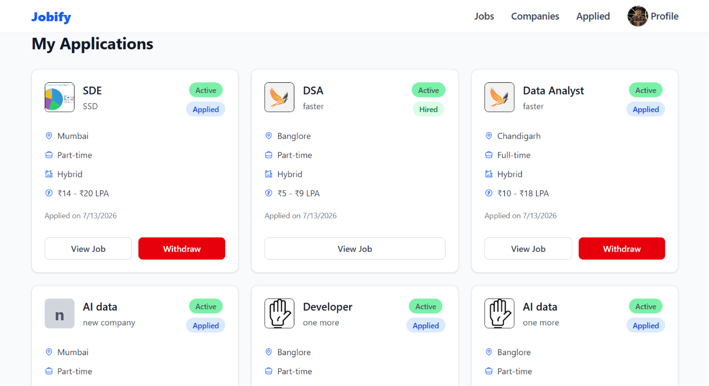
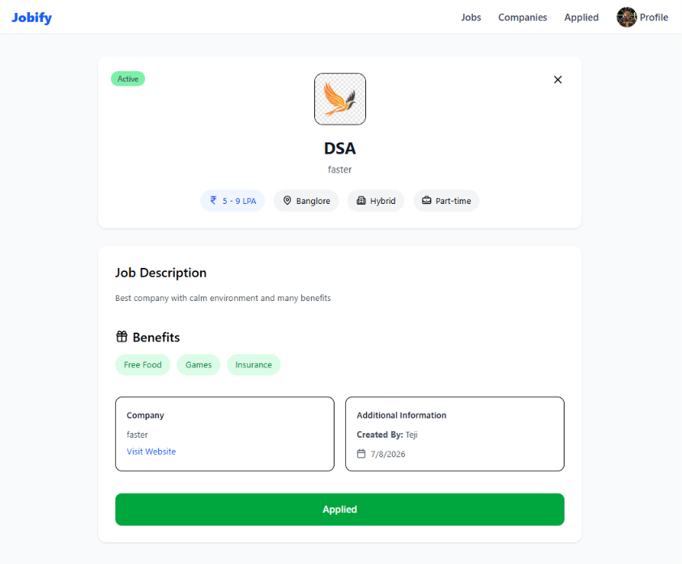
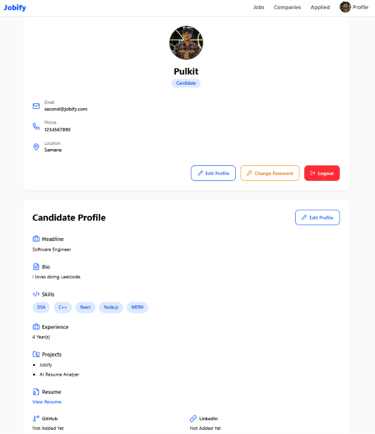
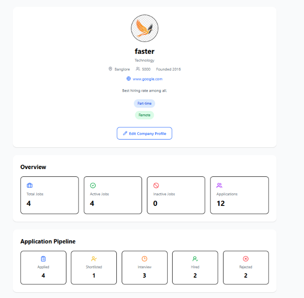
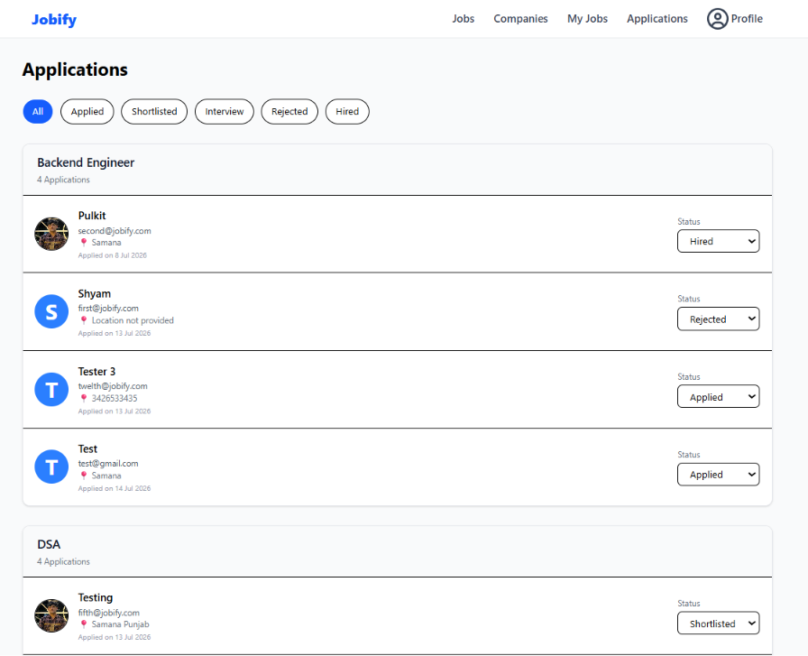

# Jobify

Jobify is a full-stack job portal built using the MERN stack that connects job seekers with recruiters. Candidates can explore opportunities, apply for jobs, and track their applications, while companies can post openings and manage applicants through a dedicated dashboard. The project was developed to gain hands-on experience with authentication, REST APIs, database design, and full-stack application development.


## 🚀 Live Demo

**Frontend:** https://jobify-nwop.vercel.app

**Backend:** https://jobify-wsi5.onrender.com


## ✨ Features

### 👨‍💻 Candidate

* Create an account and log in securely
* Browse available jobs
* Search jobs using keywords
* Filter jobs based on different criteria
* View detailed job information
* Save jobs for later
* Apply to jobs
* Track application status
* Withdraw applications
* Update profile information

### 🏢 Company

* Register and log in as a company
* Create and manage company profile
* Post new job openings
* Update existing jobs
* Delete job postings
* View all applicants for a job
* Accept or reject applications

### 🔐 Authentication & Security

* JWT Authentication
* HTTP-only Cookies
* Role-based Authorization
* Protected Routes
* Authentication Middleware
* Secure Password Hashing using bcrypt


## 🛠 Tech Stack

### Frontend

* React
* Vite
* Redux Toolkit
* React Router
* Axios
* Tailwind CSS

### Backend

* Node.js
* Express.js
* MongoDB
* Mongoose
* JWT
* bcrypt
* cookie-parser
* cors
* Multer

### Cloud & Storage

* ImageKit
- Company logo upload using ImageKit
- User avatar upload using ImageKit

### Tools

* Git
* GitHub
* Postman


## 📂 Project Structure


```text
Jobify
├── backend
│   ├── src
│   │   ├── config
│   │   ├── controllers
│   │   ├── middleware
│   │   ├── models
│   │   ├── routes
│   │   ├── utils
│   │   └── ...
│   ├── .env
│   ├── package.json
│   └── server.js
│
├── frontend
│   ├── public
│   ├── src
│   ├── .env
│   ├── package.json
│   ├── vite.config.js
│   └── vercel.json
│
└── README.md
```


## 🗄 Database Models

* User
* Company
* Job
* Application
* Candidate


## 🔄 Workflow

### Candidate

Register/Login

↓

Browse Jobs

↓

Search & Filter Jobs

↓

View Job Details

↓

Apply for Job

↓

Track Application Status

---

### Company

Register/Login

↓

Create Company Profile

↓

Post Job

↓

Manage Job Listings

↓

Review Applications

↓

Accept / Reject Candidates


## ⚙️ Installation

### Clone the repository

git clone https://github.com/goyalpulkit719-arch/Jobify.git

cd Jobify

### Backend Setup

cd backend

npm install

Create a .env file inside the backend folder.

MONGO_URI=your_mongodb_uri

JWT_SECRET=your_jwt_secret

IMAGEKIT_PRIVATE_KEY=your_imagekit_private_key

Run the backend

npm run dev


### Frontend Setup

cd frontend

npm install


Create a .env file.

VITE_API_URL=http://localhost:5000

Run the frontend

npm run dev


## 📸 Screenshots
















## 🔮 Future Improvements

* Email notifications
* Resume upload during application
* Real-time notifications
* Admin dashboard
* Bookmark collections
* Company verification


## 👨‍💻 Author

**Pulkit Goyal**

GitHub: https://github.com/goyalpulkit719-arch

LinkedIn: https://www.linkedin.com/in/pulkit-goyal1
